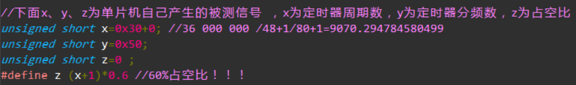
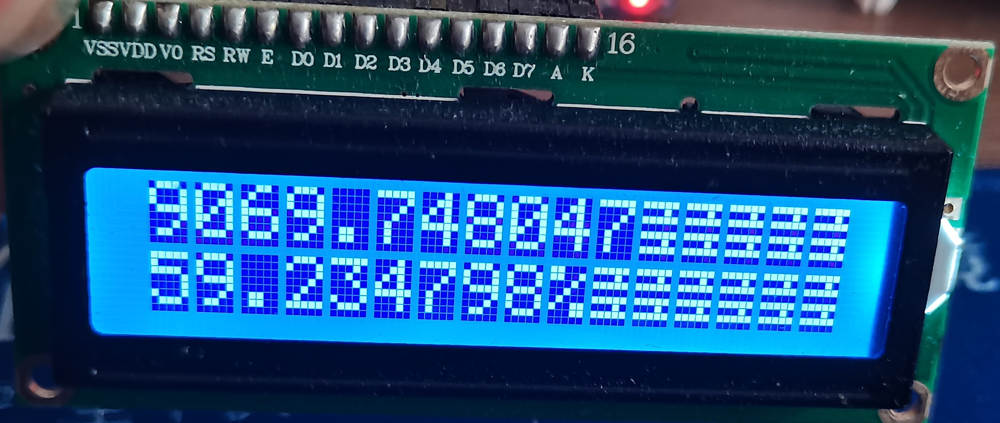

名称：等精度频率计  
平台：MDK5
芯片：stm32f103    
要求：频率 1HZ-1MHZ 0.01%精度（达标）  
&emsp;&emsp;&emsp;占空比 1HZ-0.1MHZ 0.1%精度 20%-80%占空比（除了0.1MHZ 70%以上 30%以下达不到 ，其他全部达标） 

作者：张颢文   
时间：2023.2.7（最终完善时间）   
联系方式：1711007965@qq.com  
基本原理：&emsp;等精度测频,就是所有的测量动作与被测信号同步尽可能减少,测量结束门控带来的误差，将计数误差控制在   
&emsp;&emsp;&emsp;&emsp;&emsp;&emsp;+-1 所以称为等精度本次课设用的是12MHZ信号源（单片机自己产生），理论上1/12000000 远远小于0.01%  
&emsp;&emsp;&emsp;&emsp;&emsp;&emsp;（不明白可以自行搜索等精度测量原理，希望我的代码给你带来思路）  

实现结果:(废话少说直接上图)  
   
   

&emsp;&emsp;&emsp;&emsp;&emsp;&emsp;f = 36000 000/48+1/80+1=9070.295   

&emsp;&emsp;&emsp;&emsp;&emsp;&emsp;误差=9070.295*0.0001=0.9  

&emsp;&emsp;&emsp;&emsp;&emsp;&emsp;实际误差=9070.295-9069.748=0.547<0.9(达标)  

&emsp;&emsp;&emsp;&emsp;&emsp;&emsp;d 因为short int型，所以为49*0.6=29     

&emsp;&emsp;&emsp;&emsp;&emsp;&emsp;29/49*100=59.183%  

&emsp;&emsp;&emsp;&emsp;&emsp;&emsp;误差 60%*0.001=0.05918  

&emsp;&emsp;&emsp;&emsp;&emsp;&emsp;实际误差=59.234-59.183=0.051<0.059(达标)    

功能：能显示学号（以去除防止泄露）姓名、占空比或频率测量、按键触发显示频率和占空比（同时显示无需切换）  
  
每个文件负责哪部分：  
&emsp;&emsp;&emsp;&emsp;&emsp;&emsp;pwm.c：是频率测量核心代码  
&emsp;&emsp;&emsp;&emsp;&emsp;&emsp;gpio.c：按键  
&emsp;&emsp;&emsp;&emsp;&emsp;&emsp;lcd1602.c：lcd1602驱动代码和姓名学号显示  
&emsp;&emsp;&emsp;&emsp;&emsp;&emsp;（尽可能写注释，分享正确的思路，如有错误请联系我，谢谢！）  
  
每个GPIO作用：  
&emsp;&emsp;&emsp;&emsp;&emsp;&emsp;PA8、PA9输出12MHZ 标准信号源  
&emsp;&emsp;&emsp;&emsp;&emsp;&emsp;PB5、PB4输出 设定被测信号源  
&emsp;&emsp;&emsp;&emsp;&emsp;&emsp;PB0、1、2、8、9、10、11、12、13、14、15、16 用于lcd显示（具体lcd1602.c文件）  
&emsp;&emsp;&emsp;&emsp;&emsp;&emsp;PA0 对标准信号进行计数   TIM5  
&emsp;&emsp;&emsp;&emsp;&emsp;&emsp;PE0 对被测信号进行计数   TIM4  
&emsp;&emsp;&emsp;&emsp;&emsp;&emsp;PA15 对标准信号进行测量（测占空比） TIM2  
&emsp;&emsp;&emsp;&emsp;&emsp;&emsp;PD4 被测信号信号沿（测占空比）EXTI_Line4  
&emsp;&emsp;&emsp;&emsp;&emsp;&emsp;PD1 按键      

如何接：  
&emsp;&emsp;&emsp;&emsp;&emsp;&emsp;PA8 - PA15   
&emsp;&emsp;&emsp;&emsp;&emsp;&emsp;PA9 - PA0   
&emsp;&emsp;&emsp;&emsp;&emsp;&emsp;PB5 - PE0  
&emsp;&emsp;&emsp;&emsp;&emsp;&emsp;PB4 - PD4  
&emsp;&emsp;&emsp;&emsp;&emsp;&emsp;PD1 - KEY  
&emsp;&emsp;&emsp;&emsp;&emsp;&emsp;lcd接法具体看lcd1602.c文件  
  
作者的话：  
&emsp;&emsp;&emsp;&emsp;&emsp;&emsp;网上很多的等精度频率计为FPGA所完成的，本人不懂FPGA，所以他们能不能实现不清楚，作者  
&emsp;&emsp;&emsp;&emsp;&emsp;&emsp;通过stm32f103成功验证理论的正确，同时分享出来给网友们，希望给你们的学习带来一点点  
&emsp;&emsp;&emsp;&emsp;&emsp;&emsp;的帮助，如果觉得不错的可以点github上的start给作者，这个对我很重要，不胜感激！！  
  

